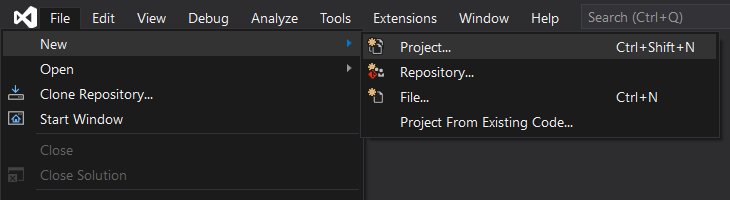
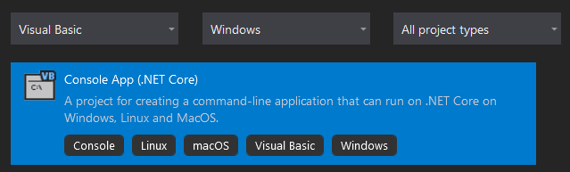
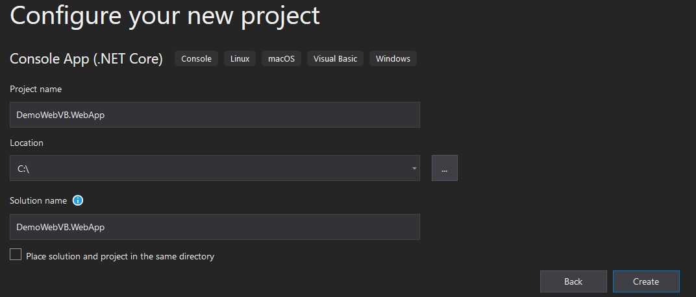
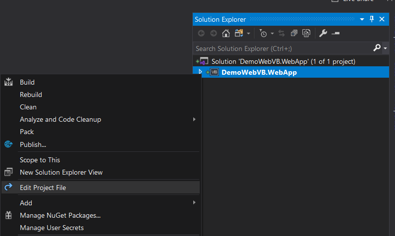
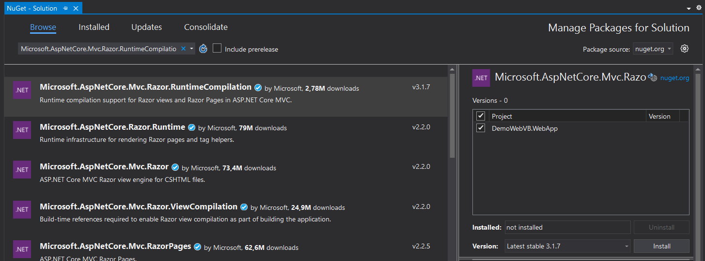
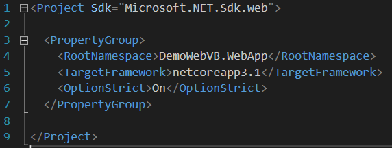

### Create an project - Quick start guide







we need to add a reference to the Microsoft.AspNetCore.Mvc.Razor.RuntimeCompilation package.
Tools -> Nuget Package Manager ->Manage Nuget Packages for the solution...
Search Microsoft.AspNetCore.Mvc.Razor.RuntimeCompilation, check the project and Install 



Replace <Project Sdk="Microsoft.NET.Sdk"> with <Project Sdk="Microsoft.NET.Sdk.web">
Remove <OutputType>Exe</OutputType>



Create a new class Startup and paste the following code :

```
Imports Microsoft.AspNetCore.Builder
Imports Microsoft.AspNetCore.Hosting
Imports Microsoft.Extensions.Configuration
Imports Microsoft.Extensions.DependencyInjection
Imports Microsoft.Extensions.Hosting

Public Class Startup

    Public ReadOnly Property Configuration As IConfiguration
    Public Sub New(configuration As IConfiguration)
        Me.Configuration = configuration
    End Sub

    ' This method gets called by the runtime. Use this method to add services to the container.
    Public Sub ConfigureServices(services As IServiceCollection)
        services.AddControllersWithViews().AddRazorRuntimeCompilation()
    End Sub

    ' This method gets called by the runtime. Use this method to configure the HTTP request pipeline.
    Public Sub Configure(app As IApplicationBuilder, env As IWebHostEnvironment)

        If env.IsDevelopment() Then
            app.UseDeveloperExceptionPage()
        Else
            app.UseExceptionHandler("/Home/Error")
        End If

        app.UseStaticFiles()

        app.UseRouting()

        app.UseAuthorization()

        app.UseEndpoints(Sub(endpoints)
                             endpoints.MapControllerRoute(
                                     name:="default",
                                     pattern:="{controller=Home}/{action=Index}/{id?}")
                         End Sub)
    End Sub

End Class
```

Edit the Program.vb file and paste the following code :

```
Imports Microsoft.AspNetCore.Hosting
Imports Microsoft.Extensions.Hosting

Module Program

    Sub Main(args As String())
        Dim builder = CreateHostBuilder(args)

        'Config here

        builder.Build().Run()
    End Sub

    Public Function CreateHostBuilder(args() As String) As IHostBuilder
        Return Host.CreateDefaultBuilder(args).
                ConfigureWebHostDefaults(Sub(webBuilder) webBuilder.UseStartup(Of Startup)())
    End Function

End Module
```