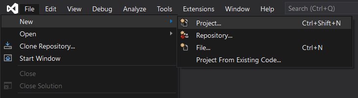
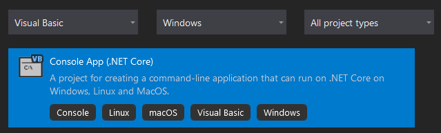
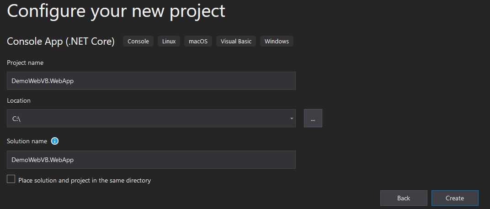
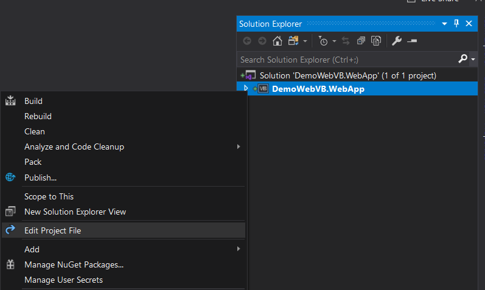
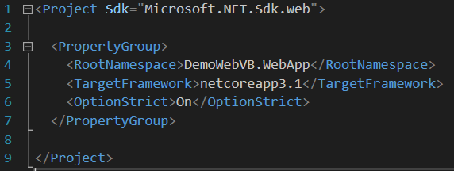
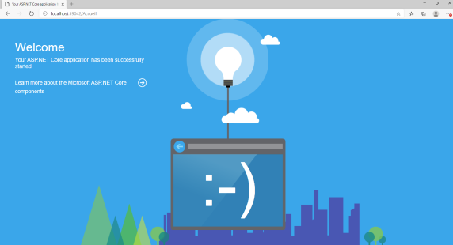
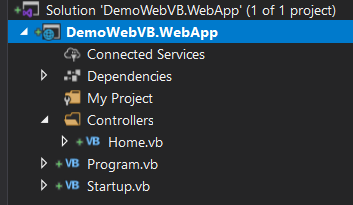
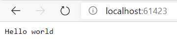

# Hello world

### 1 - Create the web project



Select "Console App (.NET Core)"
Press [Next]



Press [Create]



Right click on the project and select "Edit Project File"


Replace <Project Sdk="Microsoft.NET.Sdk"> with <Project Sdk="Microsoft.NET.Sdk.web">
Remove <OutputType>Exe</OutputType>



Create a new class Startup and paste the following code :

```
Imports Microsoft.AspNetCore.Builder
Imports Microsoft.AspNetCore.Hosting
Imports Microsoft.Extensions.Configuration
Imports Microsoft.Extensions.DependencyInjection
Imports Microsoft.Extensions.Hosting

Public Class Startup

    Public ReadOnly Property Configuration As IConfiguration
    Public Sub New(configuration As IConfiguration)
        Me.Configuration = configuration
    End Sub

    ' This method gets called by the runtime. Use this method to add services to the container.
    Public Sub ConfigureServices(services As IServiceCollection)
        services.AddControllers()
    End Sub

    ' This method gets called by the runtime. Use this method to configure the HTTP request pipeline.
    Public Sub Configure(app As IApplicationBuilder, env As IWebHostEnvironment)
        app.UseWelcomePage()
    End Sub
End Class
```

Edit the Program.vb file and paste the following code :

```
Imports Microsoft.AspNetCore.Hosting
Imports Microsoft.Extensions.Hosting

Module Program

    Sub Main(args As String())
        Dim builder = CreateHostBuilder(args)

        'Config here

        builder.Build().Run()
    End Sub

    Public Function CreateHostBuilder(args() As String) As IHostBuilder
        Return Host.CreateDefaultBuilder(args).
                ConfigureWebHostDefaults(Sub(webBuilder) webBuilder.UseStartup(Of Startup)())
    End Function

End Module
```

Running the project should display this web page :



### 2 - Adding an controller

Create Controllers folder and a new class "Home" inside



Paste the following code inside Home.vb

```
Imports Microsoft.AspNetCore.Mvc

Public Class Home
    Inherits ControllerBase

    Public Function Index() As String
        Return "Hello world"
    End Function

End Class
```

Notice: the class now inherits from ControllerBase.
ControllerBase is a base class for an MVC controllers without view support.

Replace the Configure method of the Startup class with the following:

```
    Public Sub Configure(app As IApplicationBuilder, env As IWebHostEnvironment)
        app.UseRouting()
        app.UseEndpoints(Sub(endpoints) endpoints.MapDefaultControllerRoute())
    End Sub
```

We have removed app.UseWelcomePage().
This configuration redirects all HTTP requests to the welcome page seen previously.

We have added the middleware allowing mvc to redirect requests to the correct controller actions.

[For more details about routing](https://docs.microsoft.com/en-us/aspnet/core/mvc/controllers/routing?view=aspnetcore-3.1)

Running the project should display "Hello world" in your browser

