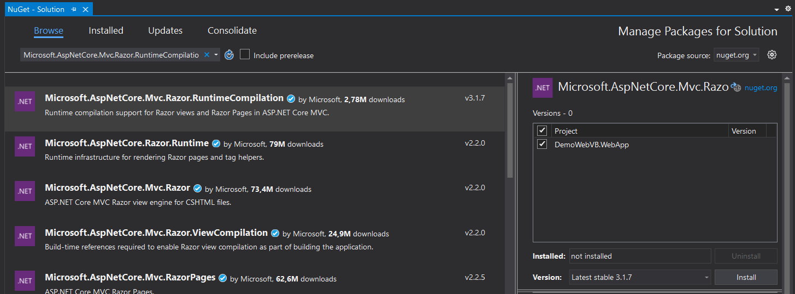
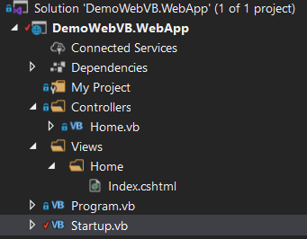

# Hello world

### 1 - Configuration

To be able to use views, we need to start by making some changes to our configuration.

In the Startup class, replace services.AddControllers() Replace xxxx in the ConfigureServices method with services.AddControllersWithViews().AddRazorRuntimeCompilation()

Then, we need to add a reference to the Microsoft.AspNetCore.Mvc.Razor.RuntimeCompilation package.

Tools -> Nuget Package Manager ->Manage Nuget Packages for the solution...

Search Microsoft.AspNetCore.Mvc.Razor.RuntimeCompilation, check the project and Install 



Let's prepare our controller so that it can render the view we're going to create right after.

To use views, our controller must inherit from Controller rather than ControllerBase and our action must return the view instead of a string.
Replace the contents of the file HomeController.vb with:
```
Imports Microsoft.AspNetCore.Mvc
Public Class Home
    Inherits Controller

    Public Function Index() As IActionResult
        Return view
    End Function

End Class
```

### 2 - Create a view

Create a Views folder, Home folder and a Index.cshtml file.



Paste the following Html inside Index.cshtml

```
<!DOCTYPE html>

<html>
<head>
    <meta charset="utf-8" />
    <title>Demo</title>
</head>
<body>
    <h1>Hello world, from a vue</h1>
</body>
</html>
```

Running the project should display "Hello world" in your browser